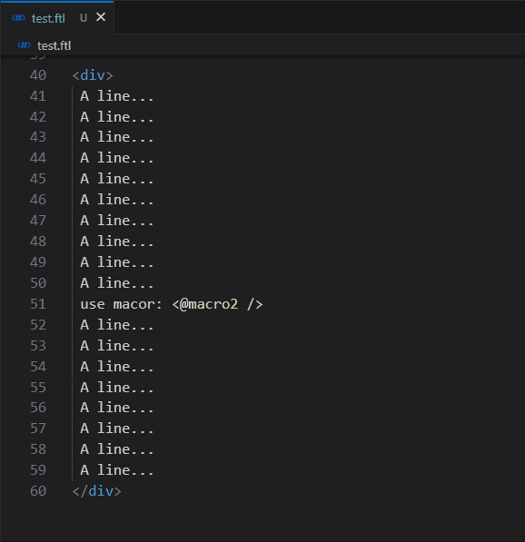
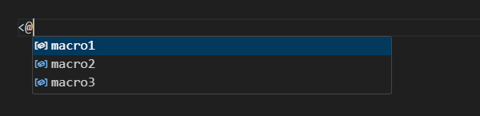
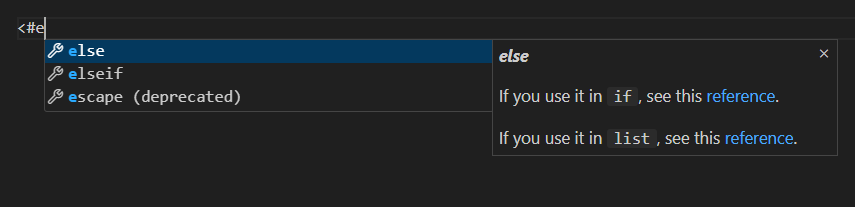
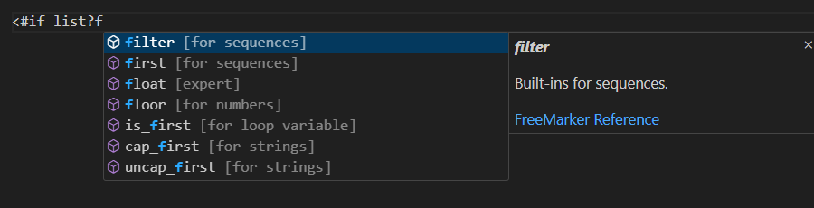

# Freemarker Tipster

`freemarker tipster` is an extension designed to enhance your experience with `ftl` files.

It allows you to quickly navigate to the definitions of macro and function variables you've written. Additionally, it provides completion tips while you are writing `ftl` files.

## Features

### Go to definition (`macro` and `function`)

> Tip: Currently, only macros and functions defined in the same file are supported. Additionally, their names can contain letters, digits, underscores, dollar signs, and at signs, but the first character cannot be a digit.

### The completion of macro variables

If you start typing with `<@`, you can get completion suggestions for the current macro variables.

### The completion of freemarker directives

If you start typing with `<#`, you can get completion suggestions for the freemarker directives.

### The completion of built-ins

